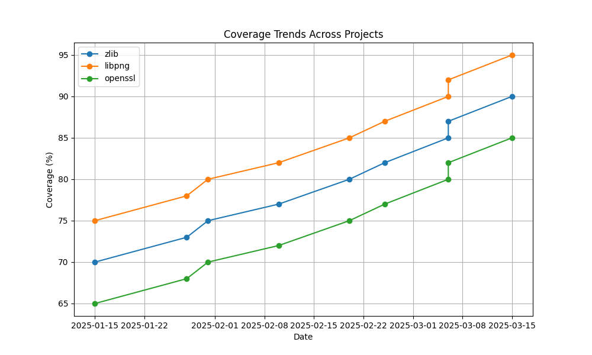

# OSS-Fuzz Coverage Analysis Proof of Concept (PoC)

This Proof of Concept (PoC) is a prototype for my proposed Google Summer of Code (GSoC) 2025 project, "Self-Contained OSS-Fuzz Module for Researchers." It demonstrates core functionalities—data retrieval, analysis, and visualization—for analyzing OSS-Fuzz project performance.

## Project Structure

```
/home/karanjot-singh/gsoc/
├── main.py                    # CLI entry point
├── pyproject.toml            # Project config and dependencies
├── README.md                 # Project documentation
├── src/
│   ├── __init__.py          # Makes src a package
│   └── oss_fuzz_analysis/
│       ├── __init__.py      # Package exports
│       └── analyzer.py      # Core analysis logic
├── tests/
│   ├── __init__.py         # Makes tests a package
│   └── test_coverage_analysis.py  # Test suite
└── outputs/
    ├── coverage_trends.png  # Generated plot
    └── oss_fuzz_analysis.json  # Analysis results
```

## Setup

Requires **Python 3.11**. Use a virtual environment for a clean setup.

1. **Clone and set up:**
   ```bash
   # Clone the repository
   git clone https://github.com/karanjot786/oss-fuzz-poc
   cd oss-fuzz-poc

   # Create and activate virtual environment
   python3 -m venv venv
   source venv/bin/activate  # On Windows: venv\Scripts\activate
   ```

2. **Install dependencies:**
   ```bash
   pip install -e .
   ```

The project uses `pyproject.toml` for dependency management and package configuration.

## Running

Execute the script via the command-line interface:

```bash
# With default settings
python main.py

# View available options
python main.py --help

# Analyze specific projects
python main.py --projects zlib libpng

# Custom output directory
python main.py --output-dir ./my-results
```

This will:
- Analyze OSS-Fuzz projects
- Generate visualization plots
- Save analysis results as JSON
- Display a summary in the console

This:
- Fetches metadata for `zlib`, `libpng`, and `openssl` from the OSS-Fuzz GitHub repository.
- Simulates crash and coverage data (to be replaced with real OSS-Fuzz data in the full project).
- Analyzes unique crashes and coverage trends.
- Generates a plot (`outputs/coverage_trends.png`) and a JSON report (`outputs/oss_fuzz_analysis.json`).

## How It Works

The core logic resides in `src/oss_fuzz_analysis/analyzer.py`:
- **`fetch_project_metadata()`**: Pulls project info from GitHub.
- **`fetch_project_data()`**: Simulates crash and coverage data.
- **`analyze_project_data()`**: Computes metrics like unique crashes and average coverage.
- **`plot_coverage_trends()`**: Visualizes trends with Matplotlib.
- **`main()`**: Ties everything together.

The `main.py` script serves as the CLI entry point, while the package can also be imported as a library.

## Outputs

- **`outputs/coverage_trends.png`**:
   - A multi-line plot showing coverage trends over time for multiple projects.
   - Each project is a distinct line with markers, plotted with dates on the x-axis and coverage (%) on the y-axis.
   - Features a legend, grid, and clear labels for easy interpretation.

   

   Example visualization showing coverage growth for zlib (blue), libpng (orange), and openssl (green) over time. The plot demonstrates increasing code coverage percentages through January-March 2025.

- **`outputs/oss_fuzz_analysis.json`**:
  - A detailed JSON report containing:
    - **Metadata**: Project info from GitHub (e.g., file structure, URLs).
    - **Analysis**: Metrics per project:
      - `unique_crashes`: Number of distinct crash hashes.
      - `avg_coverage`: Average coverage percentage.
      - `coverage_trend`: List of coverage data points with dates and growth rates.
    - **Raw Data**: Original crash and coverage datasets.

  - **Sample Snippet**:
    ```json
    {
      "metadata": {
        "zlib": {"name": "zlib", "path": "projects/zlib", ...}
      },
      "analysis": {
        "zlib": {
          "unique_crashes": 8,
          "avg_coverage": 85.0,
          "coverage_trend": [
            {"date": "15-01-2025", "coverage": 70, "growth_rate": null},
            {"date": "28-01-2025", "coverage": 73, "growth_rate": 4.29},
            ...
          ]
        }
      },
      "raw_data": {
        "zlib": {
          "crashes": [{"date": "15-01-2025", "crash_hash": "mno345", "type": "null-pointer"}, ...],
          "coverage": [{"date": "15-01-2025", "coverage": 70}, ...]
        }
      }
    }
    ```

## Relation to GSoC Proposal

This PoC validates my approach for the OSS-Fuzz research module by prototyping:
- **Data Collection**: Fetching metadata and handling simulated datasets.
- **Analysis**: Processing crash and coverage stats.
- **Visualization**: Plotting trends for multiple projects.

It's a foundation for the full GSoC project, which will:
- Replace simulated data with real OSS-Fuzz sources (e.g., ClusterFuzz, Monorail).
- Expand analysis with features like detailed crash breakdowns and Docker-based fuzzing.
- Enhance visualizations with interactive options.

## Development Notes

- **Tests**: A test suite in `tests/test_coverage_analysis.py` uses `pytest` to verify functionality (run with `pytest` after installing `pytest`).
- **Config**: `pyproject.toml` defines dependencies and metadata, following modern Python standards.

For contributions or feedback, see the full repository: [GitHub link](https://github.com/karanjot786/).

